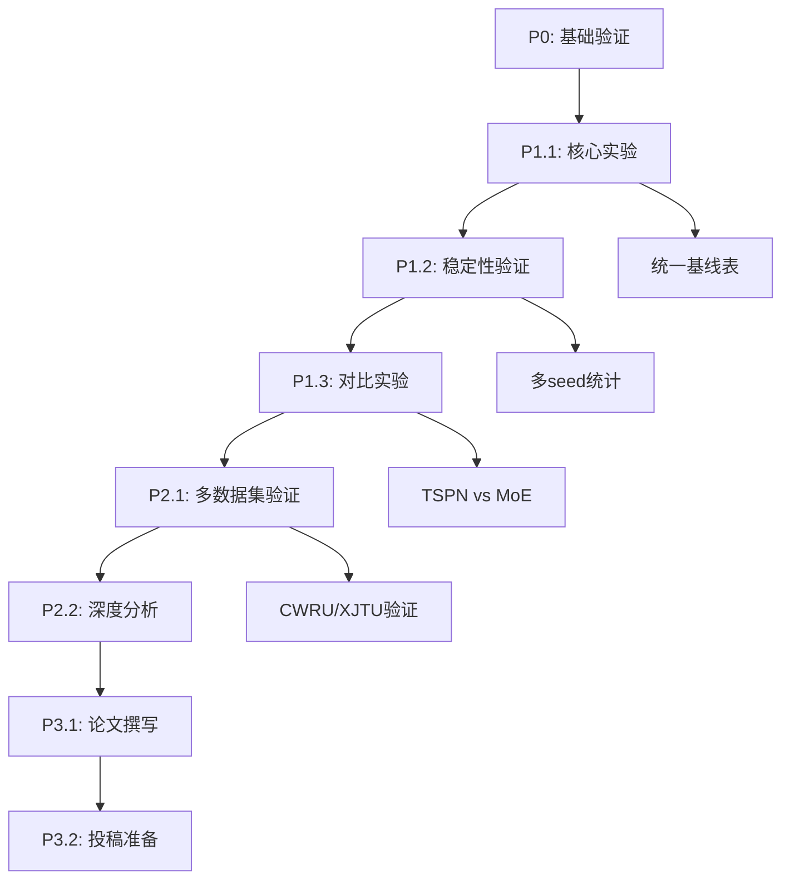

# MOE可解释性研究项目 TODO 列表
**更新日期**：2025-12-14
**项目**：Paper/MOE_explainable (Physics-Constrained MoE)
**当前优先级**：P1 > P2 > P3

---

## P0 任务 ✅（已完成）

### 基础设施与验证
- [x] **数据路径验证**：THU_018_basic数据集路径确认
  - 验证文件：`/home/user/data/a_bearing/a_018_THU24_pro/`
  - 必要文件：data.npy, IF_data.npy, labels.npy

- [x] **模型配置修复**：main_com.py中注册MoE模型
  - 添加MoEAdvancedModel导入
  - 修正MODEL_DICT中的lambda函数
  - 统一使用MoE_simple模型

- [x] **最小可运行测试**：2个epoch验证
  - 测试配置：config_MoE_3experts_test.yaml
  - 结果：训练正常，loss下降趋势明显

- [x] **seed20配置准备**：完整训练配置
  - 配置文件：config_MoE_3experts_seed20.yaml
  - 已修复模型名称问题

---

## P1 任务 🔄（进行中 - 两周内完成）

### 1.1 核心实验任务
- [ ] **锁定统一基线结果表**
  - 验收标准：README引用唯一结果表与生成脚本
  - 包含：准确率/参数量/seed列表/训练时间
  - 文件：`unified_baseline_results_table.md`

- [ ] **跑通3/5/8专家消融实验**
  - 3专家：基线配置（已有部分结果）
  - 5专家：config_MoE_5experts.yaml
  - 8专家：config_MoE_8experts.yaml
  - 验收标准：输出目录含配置快照与指标文件
  - 执行命令：
    ```bash
    CUDA_VISIBLE_DEVICES=0 python main.py --config_dir configs/unified_baseline/config_MoE.yaml
    CUDA_VISIBLE_DEVICES=0 python main.py --config_dir configs/unified_baseline/config_MoE_5experts.yaml
    CUDA_VISIBLE_DEVICES=0 python main.py --config_dir configs/unified_baseline/config_MoE_8experts.yaml
    ```

### 1.2 稳定性验证
- [ ] **多seed稳定性实验**
  - Seeds：[20, 42, 2024]（至少3个）
  - 统计指标：mean±std、95% CI
  - 验收标准：CV与CI可写入论文
  - 目标：CV < 10%

- [ ] **稳定性改进策略验证**
  - 策略1：初始化方法优化
  - 策略2：路由正则化添加
  - 策略3：学习率调度优化
  - 验收标准：对照实验表可复现

### 1.3 对比实验
- [ ] **TSPN vs MoE公平对比**
  - 36K参数量TSPN配置
  - 相同训练条件和数据集
  - 性能-参数量权衡分析
  - 配置文件：config_TSPN_MoE_comparison.yaml

- [ ] **物理约束有效性验证**
  - MoE with physics constraints
  - MoE without physics constraints
  - 性能差异分析
  - 配置文件：config_MoE_standard.yaml

---

## P2 任务 📋（计划中 - 一个月内完成）

### 2.1 多数据集泛化验证
- [ ] **PHM-Vibench数据集验证**
  - CWRU：轴承故障经典数据集
  - XJTU：轴承全寿命实验数据
  - IMS：多工况故障数据
  - 验收标准：Table 5可填；失败案例路由解释

- [ ] **跨域泛化分析**
  - 数据集间性能对比
  - 专家激活模式迁移性
  - 物理先验泛化能力

### 2.2 深度分析
- [ ] **专家消融深度分析**
  - 专家数量：[3, 5, 7, 10]
  - 路由方法：[learned, fixed, adaptive]
  - 物理约束：[soft, hard, none]

- [ ] **可解释性验证**
  - 专家-故障关联分析
  - 路由熵与性能关系
  - 物理特征一致性验证

---

## P3 任务 📅（长期目标）

### 3.1 论文撰写
- [ ] **Method部分**
  - 物理知识引导的专家设计
  - 信号处理集成架构
  - 可学习门控网络
  - 可解释性框架

- [ ] **Experiments部分**
  - 实验设置和基线对比
  - 性能对比分析
  - 可解释性验证
  - 消融实验

- [ ] **Results & Discussion**
  - Q1-Q4核心问题回答
  - 与现有方法对比
  - 局限性分析

### 3.2 投稿准备
- [ ] **目标期刊选择**
  - 首选：IEEE Transactions on Industrial Informatics
  - 备选：IEEE TSMC, Engineering Applications of AI

- [ ] **投稿材料准备**
  - 论文正文
  - Supplementary Material
  - Code Repository
  - Data & Scripts

---

## 关键路径图



---

## 执行优先级矩阵

| 任务 | 紧急度 | 重要度 | 优先级 | 预计时间 |
|------|--------|--------|--------|----------|
| 统一基线结果表 | 🔴高 | 🔴高 | P0 | 2天 |
| 3/5/8专家消融 | 🔴高 | 🔴高 | P0 | 3天 |
| 多seed实验 | 🟡中 | 🔴高 | P1 | 5天 |
| TSPN vs MoE对比 | 🔴高 | 🟡中 | P1 | 3天 |
| CWRU数据集验证 | 🟢低 | 🔴高 | P2 | 5天 |

---

## 验收标准

### P1阶段验收（两周末）
- ✅ 统一基线表包含所有模型性能
- ✅ 3/5/8专家实验完成并有可视化
- ✅ 多seed实验统计数据完备
- ✅ CV值达标或给出合理解释

### P2阶段验收（一个月末）
- ✅ 至少3个数据集验证结果
- ✅ 消融实验全面完成
- ✅ 可解释性分析充分
- ✅ 论文初稿完成

---

## 资源需求

### 计算资源
- GPU：至少2块GPU并行实验
- 时间：P1阶段需要约40小时GPU时间
- 存储：结果存储约10GB

### 依赖项
- 数据集：THU_018、CWRU、XJTU、IMS
- 代码：main.py、main_com.py
- 配置：configs/unified_baseline/

---

**最后更新**：2025-12-14
**下次review**：P1阶段完成后
**负责人**：LQ

*本TODO列表遵循SMART原则：具体、可衡量、可实现、相关、有时限。每项任务都有明确的验收标准和执行命令。*